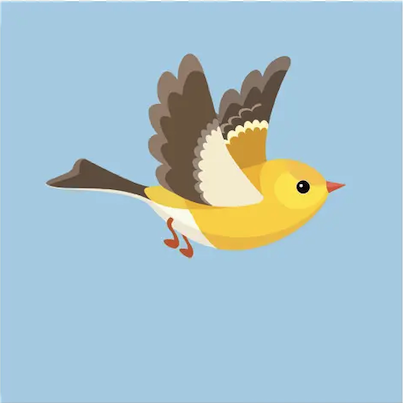
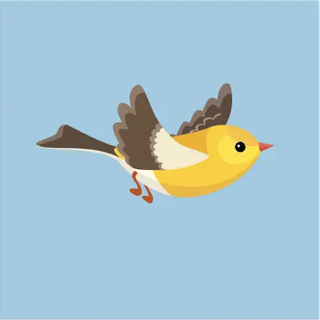
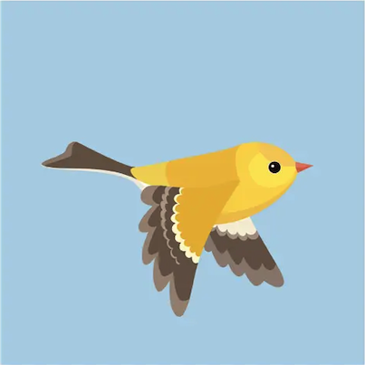
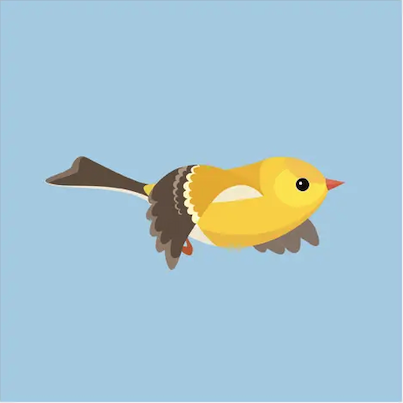

## Kapwing Interview Project by Yashmit Singh

This repo contains the code for the Kapwing interview project. The project includes both a reference Grayscale image processor and a full GIF creation tool.

For more information and a guide on how to get set up, please refer to [this Google document](https://docs.google.com/document/d/1f7MpfMQevpiHisR4LlHJLUvprPdp4tepQbx29zW59E0/edit?usp=sharing).

### Live Demo
Visit the live application at [https://interview-blond-eight.vercel.app/](https://interview-blond-eight.vercel.app/)

### Features
- Upload multiple images (JPG/PNG up to 5MB each)
- GIF preview with adjustable speeds
- Three animation speed options (slow/normal/fast)
- Drag-and-drop image reordering
- Image gallery with deletion capability
- Consistent output size (400x400) with aspect ratio preservation

### Core Technologies
- [Next.js](https://nextjs.org/) for the full-stack React framework
- [Sharp](https://www.npmjs.com/package/sharp) for image processing
- [GIF-encoder](https://www.npmjs.com/package/gif-encoder) for GIF creation
- [AWS S3](https://aws.amazon.com/s3/) for file storage
- [TypeScript](https://www.typescriptlang.org/) for type safety

### Key Implementation Details
- Images are processed using Sharp to ensure consistent sizing
- GIF creation happens server-side using GIF-encoder
- Preview matches final output by using the same dimensions and timing
- Error handling for failed uploads and processing

### Resources & Documentation
Key libraries used in this project:

Sharp - image processing
- Sharp NPM Package
- Digital Ocean Sharp Tutorial
- Sharp API Documentation

GIF Encoder - creating GIF
- GIF-encoder NPM Package
- GIF-encoder GitHub

Next.js Resources
- Next.js Documentation
- Next.js API Routes
- Deploying to Vercel

### Testing Images Used
The GIF maker was tested with a sequence of bird animation frames:

    
    
    
    

### Additional Notes
- Maximum file size: 5MB per image
- Supported formats: JPG, PNG
- Maximum frames: 20 images
- Output GIF dimensions: 400x400 pixels
- Images are fit with aspect ratio preservation
